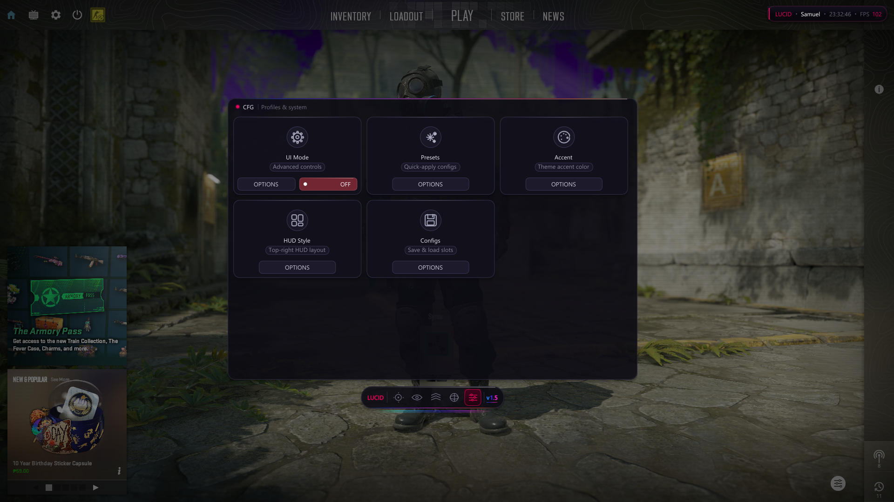

# Lucid · CS2

<p align="center">
  
</p>

<p align="center">
  <em>Internal CS2 utility — sleek card-grid menu, smooth sub-page navigation, animated RGB chrome.</em>
</p>

---

## Preview

The screenshot above shows the in-game menu running on top of CS2:

- Card-grid feature browser with per-card OPTIONS / toggle
- Lucide-style outline icons
- Animated RGB illumination strips bracketing the panel and dock
- Smooth slide animation when entering / leaving feature sub-pages

## Build

```powershell
# DLL
msbuild CS2.vcxproj /p:Configuration=Release /p:Platform=x64

# Injector
cd tools
cl /nologo /EHsc /O2 /std:c++17 /MT /Fe:..\x64\Lucid.exe injector.cpp app.res `
   /link advapi32.lib shell32.lib ole32.lib Psapi.lib
```

Outputs land in `x64/Release/CS2.dll` and `x64/Lucid.exe`.

## Layout

See [PROJECT_LAYOUT.md](PROJECT_LAYOUT.md) for the full directory map and
[docs/ARCHITECTURE.md](docs/ARCHITECTURE.md) for the high-level design.
